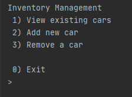
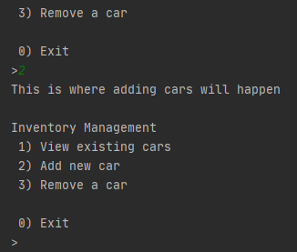
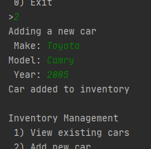
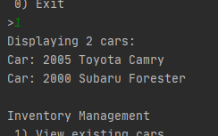
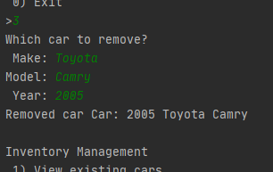
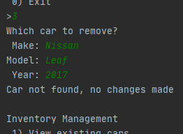
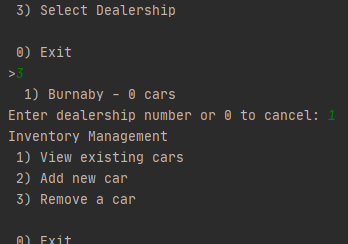

# Intro
In this assignment we're going to create an inventory tracking system for a car dealership using command line. There will be menu allowing the user to add, view, and remove cars from their inventory. The program will stay in this menu system until the user chooses to exit.  
In the last part we will add a way for the program to save what cars were currently in the inventory so that they will still be there the next time the program starts.

&nbsp;

# Program
## Part 1 - Main Menu
_The first component we are going to create is a menuing system. When the user starts the program for the first time they will see the menu, they should then be able to enter a number to select a specific menu item._  
_After the program finishes handling the action they wanted to do, it should display the menu again and wait for input again. This will continue until the user chooses to exit from the menu, at which point the program will finish._

Create a method which will print the following:



This method can be called from main, then the program should wait for a number input from the user. Once the user has entered their selection the program should call another method to do the action they chose. These methods should take no arguments and return void.

For now, simply print a message in each method acknowledging that the method was called successfully.  
Once the method is finished, the main menu should be displayed again, and the program should wait for input from the user again just like before.



The menu should be displayed so the user can pick an option until the user selects exit.

When this part is done there should be at least 4 methods in the main class:
* displayMenu()
* addNewCar()
* removeCar()
* viewAllCars()

You can create other methods if you like, but you should at least have these four methods.  
If you prefer you can also add the code for getting the menu option into displayMenu() then returning it from there.  
You don't need to use the same numbers for menuing, as long as it's clear to the user what they need to enter to pick each option.

## Part 2 - Car Inventory
### Part 2.1 - Creating supporting files
_Create a Car class so we can use it for storing cars in a list._

Because we will be storing cars, we need to create a class for `Car`. The car class should have the following variables (properties):
* String make
* String model
* int year

You can add other properties of your choice, but you must include at least these three. These properties should all be private, and you should include the proper getters and setters.

Next create two constructors for the Car class. A default constructor which initializes all properties to example values, and a constructor with arguments for each property which assigns properties from the values given by the arguments.

Lastly create a toString method which will convert a car to a string. It takes no arguments, and the returned string should _not_ contain any newlines.

### Part 2.2 - Adding cars to inventory
_Modify the addNewCar() method from part 1 so that it asks the user for values, then creates a car with those values and adds it to a list._

If you haven't already, create an ArrayList in the main class which stores Cars.  
When the user choses to add a new car, the program should ask them for the make, model, and year of the car. Once the user has entered the car's information a new car should be created and added to the list.

A success message can optionally be shown to the user once the car is added to the list.



For this part, only modify code in the addNewCar() method. The code which controls how the menu is shown and which option should be picked shouldn't affect how a car is added.

### Part 2.3 - Viewing cars in inventory
_Modify the viewAllCars() method so it displays all cars in the car list using the car's toString() method._

When the user wants to see all cars currently in inventory, the program should run through all the cars on the list (same ArrayList as was created above) and print them out one per line.



Other information such as how many cars there are can be shown if you like. Just make sure all cars are displayed, and they're shown one per line.

For this part, only modify code in the viewAllCars() method. Menu code and code for adding new cars shouldn't have any effect on how they're displayed.

### Part 2.4 - Removing cars from inventory
_Modify the removeCar() method so it asks the user for a make/model/year for the car they wish to remove. Then find that car in the list and remove it._

When the user wants to remove a car from inventory, the program needs to ask them the make/model/year for the car that they want to remove.

The program should then check each car in the list until it finds one where the make/model/year match what the user entered. When a car on the list matches you can use the found index to remove it from the list. If no cars match a message should be displayed saying that nothing was removed.




For this part, only modify code in the removeCar() method.

&nbsp;

There are a couple of ways you can improve how a car is found and removed from the list.
* Add an `equals` method to the Car class which takes arguments for make/model/year, it will then return a boolean for if the given values match the parameter values.
* Create a `compare` method in the main class which takes two cars as arguments, it will check if the properties of each car are equal and return true/false accordingly.
* Create a `compare` method in the main class which takes one car and then make/model/year as arguments, it will check if the given make/model/year are equal to the properties of the car.
* If you're feeling brave you can override the default Object.equals() method from within the Car class. That method takes an `Object` argument, so you would need to first cast it to a car then do your comparison.
* Display an id for each car in the view car list. Something like index number could work well here. Instead of asking the user for make/model/year, ask them instead for the id of the car to remove.

## Part 3 - Saving to Files
### Part 3.1 - Create a FileManager class
_Create a class to handle checking if there is an inventory file already, to read from that file, and to save to the file at the end of the program_

Create a new class called FileManager.  
<span style="font-size:70%">Note: This class is a bit different from Car in that this is a service class while Car is an entity class. The actual terminology here isn't super important, just notice that while a Car _is_ something, a FileManager _does_ something. The methods in FileManager will all work towards making it easier to _do_ a specific set of actions.</span>

The class will have one property:
* The name of the file to look for

Create a constructor which takes the file name as an argument. Save the file name in the private variable. This class doesn't need a default constructor.

We will be interacting with files a decent amount here, so for convenience you can add an import for `java.io.*` at the top of the file. This is so we can use the `File`, `FileWriter`, `FileReader`, and `IOException` classes elsewhere in our class.

### 3.2 - Checking if the file exists
Add a method fileExists(). This method won't take any arguments, and should return boolean.  
Create an instance of the `File` class in this method. Use the file name property when creating the `File` object. The `File` object then has an 'exists' method you can use to check if the file exists.

### 3.3 - Writing to the file
_Create methods which will take a list of cars and write them to the file._

Create two methods:

**carToString** which will take a single Car as an argument, and return a String.  
This is a private helper method which won't have any file interaction. It will simply take the car it is given, and convert that to a string which can be written into the file. A common storage method is csv, or Comma Separated Values.  
We will concatenate all the properties of the car together, separated with a single comma between each. Then include a single newline character at the end of the string.

For example:  
```js
Car {
    make: "Toyota",
    model: "Camry",
    year: 2005
}
=> "Toyota,Camry,2005\n"
```

**writeFile** which will take a list of cars as an argument, and won't return anything.  
Because we are working with files, we will need to catch any `IOException` errors that might occur. We need to create a `FileWriter` object and give it the file name property. Then go through the list of cars and convert each one into a string using the carToString method. Then we can write the string for each car into the file using FileWriter.write()

Don't forget to close the file once all the cars are written to it.

<span style="font-size:70%">Hint: All code for this method will be in a try block. The catch statement should catch `IOException`, it can print an error message but doesn't have to.</span>

### 3.4 - Reading from the file
_Create methods which will read lines from the file and convert them into a list of cars._

Create two methods:

**parseCar** which will take a String as an argument, and return a Car object  
This is a private helper method which won't have any file interaction. It will simply take the String it is given, and convert that into a Car object.  
The file we saved before was in csv format, with one car per line. We will be giving one line at a time to this method, so to convert one line to a Car we split the string by commas. Then the order of items in the returned array will be make,model,year. In the constructor for Car; make and model are strings, but year needs to be an integer. We can convert from string to integer using `Integer.parseInt(str);`  
Once we've converted the year to integer we can use the make and model from the split string along with the parsed year to create a new Car.

**readFile** which won't take any arguments, and will return a list of cars  
Because we are working with files, we will need to catch any `IOException` errors that might occur. We need to create a `FileReader` object and give it the file name property. Then to actually read lines from the file we need to create a `Scanner` object and give it the `FileReader` object we just created.  
Then the scanner has a `hasNextLine` method which will tell us if we are at the end of the file yet, and a `nextLine` method which will give us the next line from the file. With each line, we can call our parseCar method, and add the Car we get back to a list.

Don't forget to close the file once we have finished reading all the lines from it.  
Once we've finished reading the file, we should have a completed list of all the cars we read from it.

### 3.5 - Using FileManager to get inventory on startup
_Once we've created the class for managing our inventory file. We need to use it to see if we have an inventory file, and read inventory from the file at the beginning of the program._

The first thing we want to do when the program starts is check if an inventory file exists, and if yes then get everything from it so the car list is ready once the user gets to the main menu.

We will be using the same file for saving our inventory at all times. So we should make a private static FileManager variable outside main and initialize it with the filename we want to use. (eg. "inventory.txt")

Then at the beginning of main, before the code for showing and handling the menu, use the FileManager object to check if the file exists. If the file does exist we can use readFile() to get all cars and store the returned list into our inventory variable.

### 3.6 - Using FileManager to save inventory on exit
_When the user wants to exit the program, use the FileManager object to write current cars into the inventory file._

To write the current inventory to a file at the end of the program. We simply need to call the writeFile method using our FileManager object and give it the current inventory list. We can make this call as the last line in main and it will happen as the last thing before the program finishes runnning.

## Other Notes
* Most if not all of the varibles and methods in the main class will be private static or local to functions.
* Each individual method doesn't need to be super huge. In my reference program my longest method is main at about 20 lines long.

&nbsp;

# Bonus Sections
## Multiple Dealerships
_Instead of having a single list of cars for the entire program, we can add a way to distinguish between different dealerships. Each dealership would have thair own separate inventory list._

### Create a Dealership class
_We need a class for a dealership which will contain it's location and list of cars. The class will have methods for adding/removing cars from the inventory of the specific dealership._

Create a Dealership class. A dealership has at least two properties:
* Location
* List of cars (inventory)

Create a constructor which takes the location of the dealership as an argument. When a dealership is first created there aren't any cars there. So we can save the given location and just initialize an empty list of cars.

Then we need to create the proper getters and setters. Make sure in the getter for inventory you make a deep copy of the list so you can keep the list private.

Then we need to add methods for managing the dealership's inventory:
* A method for adding a car  
    This method should take the car to be added as an argument. The car can be added to the list, and nothing needs to be returned.
* A method for removing a car  
    This method should have some way to identify the car in the arguments. It can go through the dealership's inventory until if find the car to remove, then remove that car. You can optionally return a boolean indicating whether a matching car was found.

### Use the Dealership class
_We need to convert the old method of using a single inventory list to the new method using the Dealership class. For now we will continue to assume only a single dealership exists._

Change the private inventory variable in the main class to be a `Dealership` instead of an `ArrayList<Car>`. Then the methods for adding/viewing/removing will need to be updated.

**addCar** - Getting Car information from the user and creating a Car object will be the same. Once you have a Car object, instead of calling add on an ArrayList, we can call addCar on our Dealership object.  
**viewCars** - If we get the inventory from the dealership and store it in a local variable, we can then use that variable the exact same way as we used the inventory list from before.  
**removeCar** - Once we get the car information from the user, we can give that to the dealership to remove instead of having to search for the car ourselves. So this method could actually end up being much shorter than before.

**loading from file** - Similar to adding a single car from the menu; the readFile method from FileManager returns a list of cars, so instead of adding them to the list using ArrayList.add() they can be added to the dealership using Dealership.addCar()  
**saving to file** - The current writeFile method will save whatever list of cars we give it. So instead of giving it a list we keep in a static variable we can give it a list we get from the dealership.

### Update the menu system
_There are a few different ways the menus could be organised to allow for multiple dealerships. For this assignment we will have the user manage one dealership at a time by selecting it before moving on to car management. This means there will be two layers of menus: The first menu will ask the user to add, remove, or select a dealership; then once a dealership is selected they can update the inventory for that dealership. Once the user is finished updating their selected dealership they can return to the previous menu to select another or exit from the program._  
&nbsp;

#### Modularize the current menu
_The current menu system works well, but it's relatively specialized to a single dealership. We will create another class for it so once we've selected a dealership we can hand off to that class to manage the dealership._

Create another class called `DealershipManager`. We are going to move all the code for managing a single dealership into this class.  
Add a contructor to `DealershipManager` which takes a Dealership and Scanner as arguments, and saves them as class properties.

Create a public method in DealershipManager called dealershipMenu. It won't take any arguments and won't have any return value. Move the menu code from the main method into the dealershipMenu method. Be sure to leave behind the code for using our FileManager class, we only want to move the menu system itself.

In the menu we make calls to the methods `showMenu()`, `addCar()`, `viewCars()`, and `removeCar()`; move those methods into DealershipManager, and remove the static keyword from them. If you've called the dealership or scanner properties something different than what they were called in the main class, remember to update the variable names used in these methods.

<span style="font-size:70%">Note: By this point the main class probably has no methods other than main, and only a couple of lines of code in the main method. Those lines being the ones where we used the FileManager class to save/load files.</span>

#### Create a 'Dealership Selection' menu
_Now that the old menu system is in a class where it only has to worry about one dealership at a time. Create a menu system in main which will allow the user to select a dealership to update._

Similar to what was done in [Part 1](##-Part-1---Main-Menu) of this assignment, create a menu system in main with the following options:
* Add Dealership
* Remove Dealership
* Select Dealership

Again, when this part is done there should be at least 4 methods in the main class:
* displayMenu()
* addDealership()
* removeDealership()
* selectDealership()

You can create other methods if you like, but you should at least have these four methods.

#### Managing Dealerships
_Modify the add/remove dealership methods so they ask the user for the dealership's location, then updated the dealership list accordingly._

If you haven't already, change the static Dealership variable to be an ArrayList&lt;Dealership&gt;. The code using FileManager will break, so we can comment that out for now.

Similar to [Part 2.2](###-Part-2.2---Adding-cars-to-inventory) & [Part 2.4](###-Part-2.4---Removing-cars-from-inventory), we want to update the menu methods so they manage the list of dealerships.

**Add Dealership** - Modify addDealership() so it asks the user for a dealership location, then creates a new Dealership with that location and adds it to the list.  
**Remove Dealership** - Modify removeDealership() so it asks the user for a dealership location, then removes a dealership at that location from the list. Or says no dealership was found if there isn't one.

#### Managing inventory for a specific dealership
_When the user wants to manage the inventory for a dealership, first ask them which dealership they want to update. Then use the menu system written before to manage the dealership they select._

Modify selectDealership() so it displays a list of dealerships similar to the list from [Part 2.3](###-Part-2.3---Viewing-cars-in-inventory).  
Once the list is shown, ask the user to enter which dealership they would like to update. Get that dealership from the list, then create a new DealershipManager giving it the dealership from the list and the scanner we've been using for user input.

<span style="font-size:70%">Note: There isn't really a particular reason we gave the scanner as an argument instead of re-creating it from within the DealershipManager class. Reasons for passing as an argument are so you use the same input source object across the whole program. While reasons for recreating it would be because a scanner for user input isn't really directly related to a class meant for managing dealerships. With better structure the classes could be reorganised so all user input happens in a different class entirely, but that's more work than it would be worth for this program.</span>

Once we've created a DealershipManager object we can call the `dealershipMenu()` method from it. That will show the old menu from before and it will handle updating the dealership we gave to the manager on the previous line.



### Update the File Manager
_The file manager still only works for a single dealership. There are a couple of ways we can store multiple dealerships, for this assignment we are going to store everything in the same file. The first line in the file will have a dealership's location. Then the following lines will have the cars at that location. We can have an empty line between dealerships so when we see an empty line we know the next line will be dealership location again followed by more cars._

#### Update writing to file
First we should make a method that will convert a single Dealership to a string. Create a method called **dealershipToString** that takes a Dealership as an argument and returns a String.

Strings are immutable (ie they can't be changed after they're created, you can only make a new string), so string actions can sometimes get slow if you're making lots of changes to long strings. To help manage building our Dealership string we will use the built-in `StringBuilder` class. Create a new `StringBuilder` object at the top of dealershipToString, every time we want to add text to our string we can use `stringBuilder.append("NewText")`.

Our format for dealerships is the location of the dealership, followed by the list of cars. So the first thing to add to the string builder will be the location of the given dealership followed by a newline character.

After the dealership location we want to add all the cars at that location. We already have a method for converting cars to CSV strings. So for each car in the dealership's inventory we can call carToString and append the return value to the string builder.

Once all the cars from the dealership have been added, we need to return our constructed string. A StringBuilder's `toString()` method will finalize a String with everything we added to it so we can return it from the method.

Next we can modify the **writeFile** method so it takes a list of Dealerships instead of Cars. Then instead of calling the carToString method we can call the dealershipToString method.  
The last part of the file format is an empty line between dealerships. After each dealership we write to the file using dealershipToString, write one more newline character to the file.

#### Update reading from file
First we should make a method which will read all the information for a dealership from the file. Create a method called `readDealership` which takes a Scanner as an argument and returns a Dealership.

<span style="font-size:70%">Note: We're using the scanner here to read directly from the file instead of reading first then passing the raw strings to the method. In contrast to writing to the file where we called dealershipToString then wrote the returned string in writeFile. Because a dealership can span multiple lines it's easier to let the dealership figure out when it's finished for itself instead of trying to manage it from a centralized method. That's also a reason why we added an empty line while writing to the file: That way the dealership can eat the empty line when it discovers it's finished and we won't risk losing data from the next dealership.</span>

According to our format the first line in each dealership section will be the location of the dealership. So we can read one line from the scanner and create a new Dealership giving it that as its location.

Next we need to continue reading lines from the file until we get to a line that's empty. Every time we read a line that's not empty we can parse that into a car and add the car to the newly created dealership.

<span style="font-size:70%">Note: A tidy way of doing this could be with a for loop. This would be one of those rare times we don't actually use the normal `for (int i = 0; i < ___; i++)` format. Instead, because we know we've already read the dealership location we can initialize the for loop with `String line = scanner.nextLine()`. That will put the first 'car' line into a string. Then because we know dealerships all have an empty line between them our condition would look for that empty line: `!line.equals("")`. Lastly once we've finished parsing the car from a line then we want to move on to the next line, so just grab the next line from the scanner with `line = scanner.nextLine()`  
Another thing we can note here is that the initialization and increment parts of the for loop are basically the same. If you find yourself with a for loop that's not the standard one, then having the initialization and increment as the same thing is quite common.</span>

Once the readDealership method finds an empty line then it knows that it has finished reading cars. So we can return the Dealership object we created.

Next we need to modify the **readFile** method to return a list of dealerships instead of cars. Because we're using the readDealership method to actually read from the file. We don't need any reading methods here. All we need to do is verify that we're not at the end of the file using `scanner.hasNextLine()`, and if there's more we'll let readDealership get another dealership from the file. We can add the dealerships we get back from readDealership to a list, then return that list when we get to the end of the file.

### Use updated file manager
Now that the file manager is updated, we can use the new methods to get and store lists of dealerships instead of cars.  
Uncomment the code using FileManager in the main method. Now that the readFile method gives us a list of dealerships, we can copy those dealerships into the static list in the main class. Then at the end of the file, the writeFile method takes a list of dealerships, we can give it the static list in the main class.

<span style="font-size:120%">Don't forget to delete the old inventory file before testing the program again! The file format has changed so the new FileManager won't know how to read the old file!</span>

### Quality of Life changes
* Show which dealership is currently selected in the DealershipManager menu

## GUI
